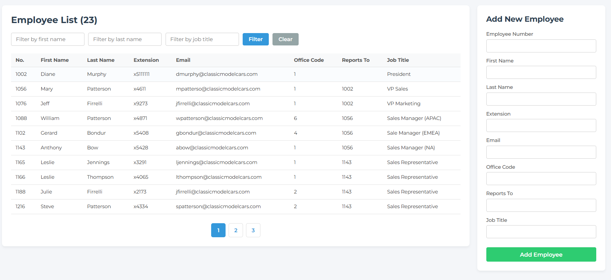

# 👥 Employee Management System

A simple full-stack Employee Management System built with **Node.js, Express.js, EJS, and MySQL**.

The application allows users to manage employee records through a clean web interface and is deployed online using **Railway**.

## 🌐 Live Demo

👉 [View Live Website](https://employee-management-production-7756.up.railway.app/)

---

## 📸 Preview



---

## ✨ Features

- View employee information
- Add new employees
- Edit employee details
- Delete employees
- Filter employees by:
  - First name
  - Last name
  - Job title
- Pagination
- MySQL database integration
- Responsive web interface
- Online deployment with Railway

---

## 🛠️ Tech Stack

### Backend

- Node.js
- Express.js

### Frontend

- EJS
- HTML
- CSS
- JavaScript

### Database

- MySQL

### Deployment

- Railway

---

## 📂 Project Structure

```text
employee-management/
│
├── controllers/
│   └── employeeController.js
│
├── models/
│   ├── pool.js
│   └── queries.js
│
├── routes/
│   └── employeeRouter.js
│
├── views/
│   ├── employee-page.ejs
│   └── error-page.ejs
│
├── public/
│   ├── styles/
│   │   └── employee-page.css
│   └── scripts/
│       └── employee-page.js
│
├── assets/
│   └── employee-management.png
│
├── app.js
├── package.json
├── .gitignore
└── README.md
```

---

## ⚙️ Installation

### 1. Clone the repository

```bash
git clone https://github.com/hoangviet47206/employee-management.git
```

### 2. Go to the project directory

```bash
cd employee-management
```

### 3. Install dependencies

```bash
npm install
```

### 4. Configure environment variables

Create a `.env` file in the root directory and configure your database connection.

```env
DB_HOST=your_database_host
DB_PORT=your_database_port
DB_USER=your_database_user
DB_PASSWORD=your_database_password
DB_NAME=your_database_name
```

### 5. Start the application

```bash
npm start
```

Then open:

```text
http://localhost:8000
```

---

## 🗄️ Database

The project uses **MySQL** to store and manage employee information.

The application demonstrates common database operations including:

```text
CREATE
READ
UPDATE
DELETE
```

These operations are handled through the Express backend and MySQL queries.

---

## 🚀 Deployment

The application is deployed using **Railway**.

```text
User
  │
  ▼
Public Website
  │
  ▼
Node.js + Express
  │
  ▼
MySQL Database
```

The source code is hosted on GitHub, while Railway runs the application and database online.

---

## 🎯 What I Learned

Through this project, I practiced:

- Building a web server with Express.js
- Using MVC-style project organization
- Working with EJS templates
- Connecting Node.js to MySQL
- Performing CRUD operations
- Handling forms and HTTP requests
- Filtering and paginating database records
- Using environment variables
- Deploying a Node.js application
- Connecting a deployed application to a cloud database

---

## 👨‍💻 Author

**Nguyễn Hoàng Việt**

Cybersecurity Student at VNU University of Engineering and Technology (VNU-UET)

GitHub: [@hoangviet47206](https://github.com/hoangviet47206)